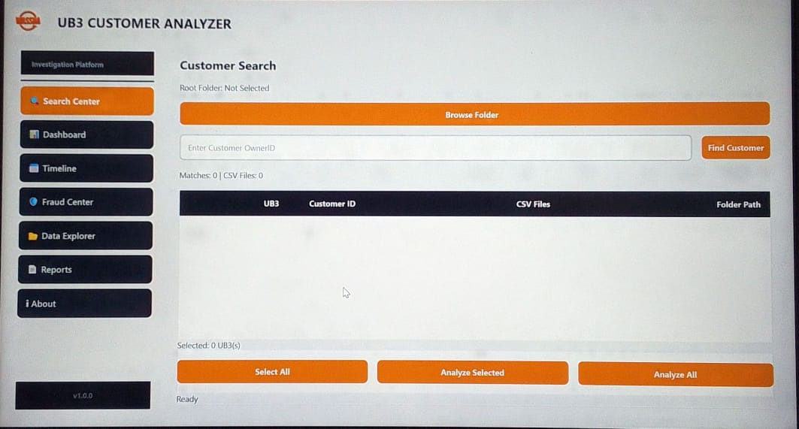
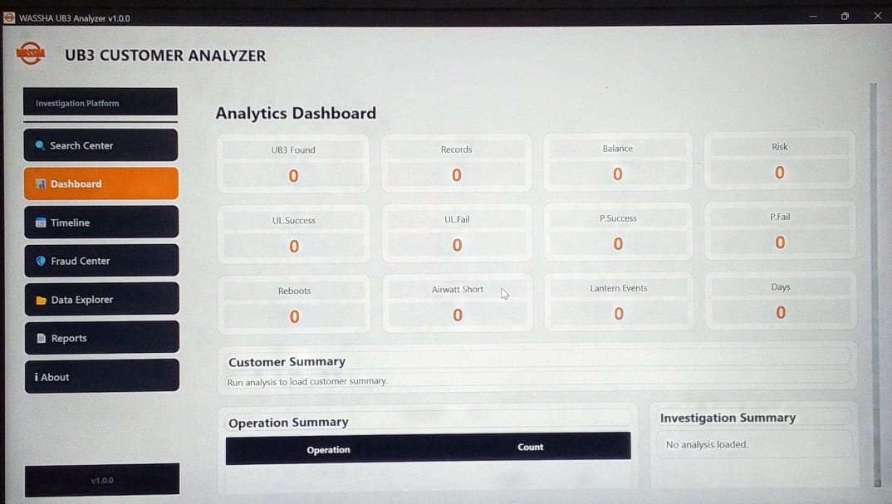
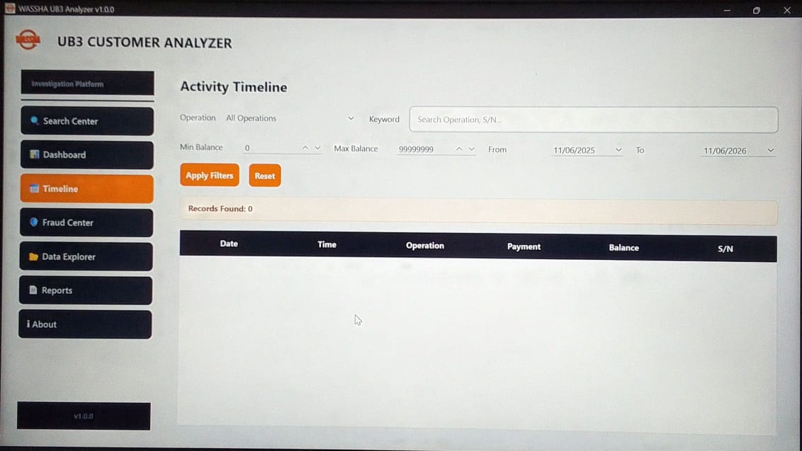
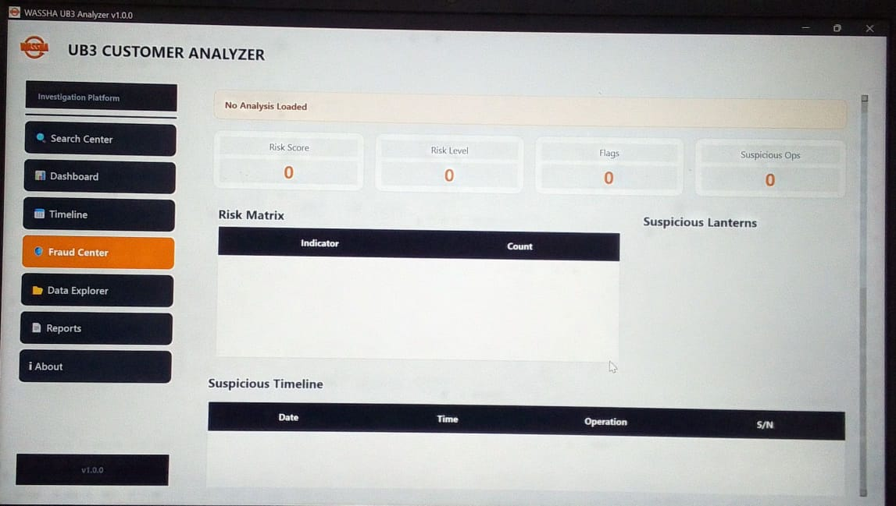

# UB3 Customer Analyzer 🔍📊


Professional desktop application for analyzing UB3 customer logs, investigating operational activities, detecting suspicious behavior, and generating investigation-ready reports.

Built with **Python**, **PySide6**, **Pandas**, and **OpenPyXL**.

---

## 🌐 Project Overview

UB3 Customer Analyzer is an offline desktop tool designed to process and investigate customer activity logs generated by UB3 remote controllers.

The system automatically:

* Finds customer folders across multiple UB3 devices
* Merges daily CSV logs
* Builds customer activity timelines
* Detects suspicious behavior
* Calculates fraud risk levels
* Generates investigation-ready Excel exports

---

## 📸 Screenshots

> Screenshots will be added in future releases.

### Search Center



### Analytics Dashboard



### Timeline Investigation



### Fraud Investigation Center



---

## ✨ Features

### 🔎 Customer Search Center

* Recursive Customer ID search
* Deep nested UB3 folder discovery
* Multi-UB3 customer detection
* UB3 serial identification
* Customer folder tracking
* CSV file counting
* Analyze Selected UB3s
* Analyze All UB3s
* Checkbox selection workflow

### 📁 CSV Processing Engine

* Multi-file CSV merge
* Automatic encoding detection
* Invalid character cleaning
* Data normalization
* Excel export generation
* Batch processing support

### 📊 Analytics Dashboard

* UB3 count
* Record count
* Current balance overview
* Risk level indicator
* Investigation summary

### 📅 Timeline Investigation Center

* Activity timeline
* Operation filtering
* Date range filtering
* Balance filtering
* Keyword search
* Serial number search
* Sortable records
* Record statistics

### 🚨 Fraud Investigation Center

* Fraud risk scoring

* Alert detection

* Operation breakdown

* Risk classification

  * LOW
  * MEDIUM
  * HIGH
  * CRITICAL

* Investigation recommendations

* Fraud summary dashboard

### 📤 Export Center

* Excel report generation
* Cleaned dataset export
* Investigation-ready outputs
* Historical record preservation

---

## 🛠 Technologies Used

| Backend                                                              | Desktop UI                                                        | Data Processing                                                            | Export                                                           |
| -------------------------------------------------------------------- | ----------------------------------------------------------------- | -------------------------------------------------------------------------- | ---------------------------------------------------------------- |
|  |  |  |  |

---

## 📂 Supported Folder Structure

```text
ROOT

├── UB332203999384
│   ├── ID0000033883
│   │   ├── day1.csv
│   │   ├── day2.csv
│   │   └── day3.csv
│   │
│   └── ID0000034565
│       ├── day1.csv
│       ├── day2.csv
│       └── day3.csv
│
├── UB332204999111
│   └── ID0000045678
│       ├── day1.csv
│       └── day2.csv
```

The analyzer automatically searches nested folders and locates matching customer IDs.

---

## 📂 Project Structure

```text
UB3Analyzer/

├── core/
│   ├── analytics.py
│   ├── fraud.py
│   ├── customer_finder.py
│   ├── csv_merger.py
│   └── analysis_session.py
│
├── ui/
│   ├── main_window.py
│   │
│   ├── tabs/
│   │   ├── search_tab.py
│   │   ├── dashboard_tab.py
│   │   ├── timeline_tab.py
│   │   └── fraud_tab.py
│   │
│   └── widgets/
│       └── dashboard_card.py
│
├── exports/
├── assets/
├── docs/
│   └── images/
│
├── tests/
│
├── main.py
├── requirements.txt
├── README.md
├── CHANGELOG.md
└── LICENSE
```

---

## 🚀 Getting Started

### Clone Repository

```bash
git clone https://github.com/Benon78/UB3-Investigation-Tool

cd UB3-Investigation-Tool
```

### Create Virtual Environment

```bash
python -m venv venv
```

### Activate Virtual Environment

Windows:

```bash
venv\Scripts\activate
```

### Install Dependencies

```bash
pip install -r requirements.txt
```

### Run Application

```bash
python main.py
```

---

## 📋 Supported Operations

Current investigation engine recognizes:

* UL.Success
* UL.Success.NFP
* UL.Fail
* UL.Fail(ensure_process)
* T.Success
* N.Sleep
* N.WakeUp
* UL.Airwatt short
* P.Success
* P.Fail
* D.Index
* D.Passcode
* AL.Unlocked
* F.Reboot
* S.OwnerID

Additional operation types can be added as operational requirements evolve.

---

## 🗺 Roadmap

### Version 0.6.0

* Raw Data Explorer
* Excel-like filtering
* Column search
* Export selected records

### Version 0.7.0

* Visual analytics charts
* Balance trend analysis
* Payment analytics
* Activity summaries

### Version 0.8.0

* Advanced fraud detection engine
* Fraud pattern recognition
* Customer behavior profiling
* Investigation automation

### Version 1.0.0

* PDF report generation
* Windows installer
* Production release
* Enterprise reporting

---

## 🤝 Contributing

Contributions are welcome.

* Fork the repository
* Create a branch

```bash
git checkout -b feature/your-feature
```

* Commit your changes

```bash
git commit -m "Add feature"
```

* Push your branch

```bash
git push origin feature/your-feature
```

* Open a Pull Request

---

## 📞 Contact

**Maintainer:** Benjamin William

📧 Email: [wilbenjamin7@gmail.com](mailto:wilbenjamin7@gmail.com)

📱 Phone: +255 764 422 305

🐙 GitHub: https://github.com/Benon78

---

## 📄 License

This project is licensed under the MIT License.

See the LICENSE file for details.
